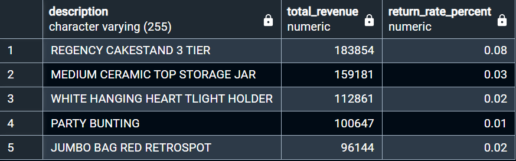
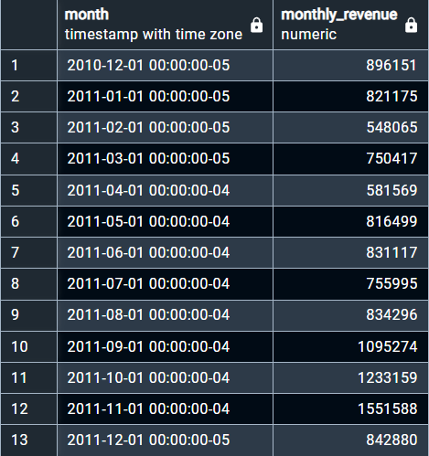
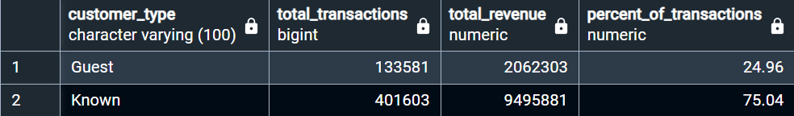
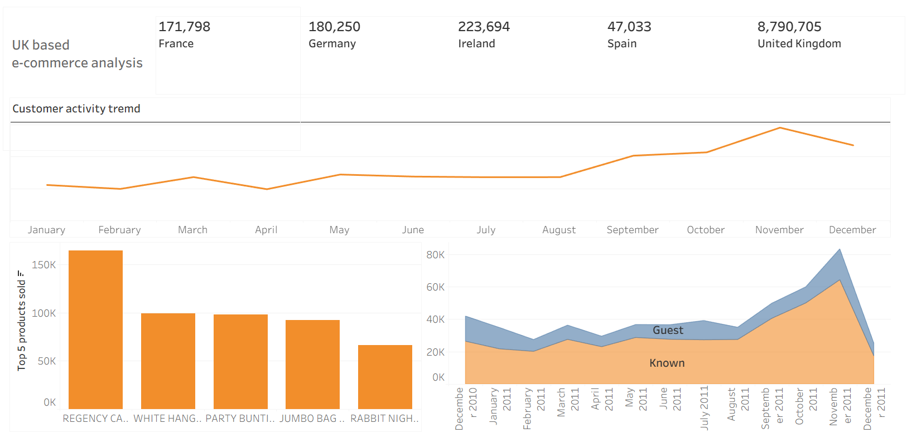

# UK-based-e-commerce-analysis
Analytics portfolio

This project explores a UK based e-commerce retailer's data to understand customer behavior and improve retention strategies. 
The goal was to clean the data, explore relationships through SQL queries, and create visual dashboards in Tableau.

---

##  Table of Contents
- [Project Background](#project-background)
- [Tools Used](#tools-used)
- [Data Cleaning & Preparation](#data-cleaning--preparation)
- [Exploratory Data Analysis](#exploratory-data-analysis)
- [Key Insights](#key-insights)
- [Recommendations](#recommendations)
- [Files Included](#files-included)
- [Dataset Source](#dataset-source)
- [Gallary](#gallary)  including queires used and dashboard preview

---

##  Project Background

This project explores customer purchasing behavior in an online retail store. 
Using a dataset containing transactional data for a UK-based online retailer, 
the analysis aims to uncover sales trends, identify best-selling products,
and highlight opportunities for improving customer targeting and retention strategies.

---

##  Tools Used

- **SQL** – Data extraction, cleaning, window functions, and aggregation
- **Excel** – Additional data validation and export
- **Tableau** – Interactive visual dashboards

---

##  Data Cleaning & Preparation

- Used `window function` operations in SQL to view correlation between
  customer behavior and seasonal trends
- Removed null values and standardized categorical variables
- Filtering out negative quantities and transactions marked as returns
- Handling missing customer IDs by categorizing them as "Guest" users

---

##  Exploratory Data Analysis

- Assigned missing `customerid` as "Guest for better accuracy
- Analyzed monthly revenue and sales volume trends
- Built views for Tableau to visualize key metrics

---

##  Key Insights

- **What are the total revenue trends over time?**:  
  **December** showed a **significant spike in revenue**, indicating **strong seasonal effects**.

- **How does customer behavior differ between registered and guest users?**:  
  Guest users accounted for the **majority of returns**, suggesting a **need for better engagement**.

- **Which products generate the highest revenue and how often are they returned?**:  
  The **REGENCY CAKESTAND 3 TIER** emerged as the **best-selling** product with a **low return rate 8%**.

---

##  Recommendations

- **Focus retention** efforts on **guest users** by encouraging **account creation with incentives**
- **Optimize stock levels** for popular products like the "REGENCY CAKESTAND 3 TIER" ahead of peak months
- **Investigate return reasons** for frequently returned items to reduce refund costs
- **Run promotions** in **Q4** to **capitalize on high holiday spending**

---

##  Files Included

- `Online_retail_project_db.sql` – Creates normalized customer, campaign, and outcomes tables, contains grouped age analysis, merges tables and cleans data contact method success, and monthly trends
- `Online_retail.twbx` – Tableau workbook with key insights and visualizations
- `Online Retail.xlsx` – Cleaned dataset in Excel format

---
## Dataset Source

-[https://archive.ics.uci.edu/dataset/352/online+retail](URL)

---

## Gallary

- Results from queries used in postgres

  

  

  

- Dashboard Preview

